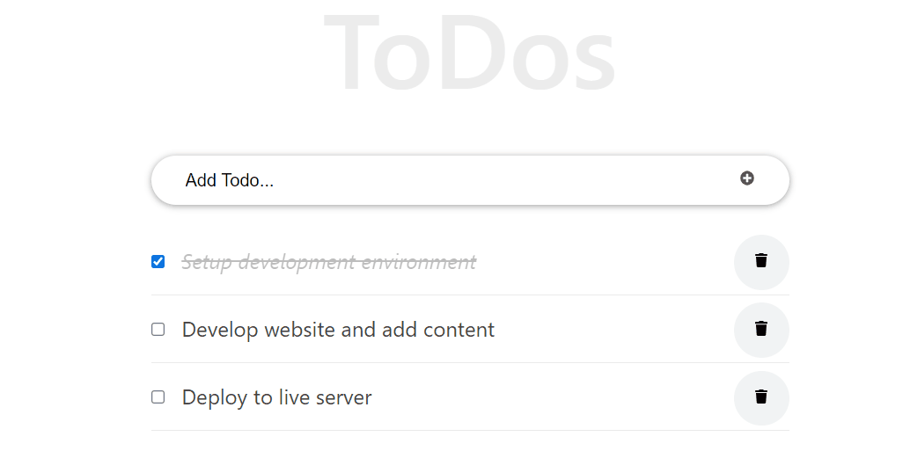
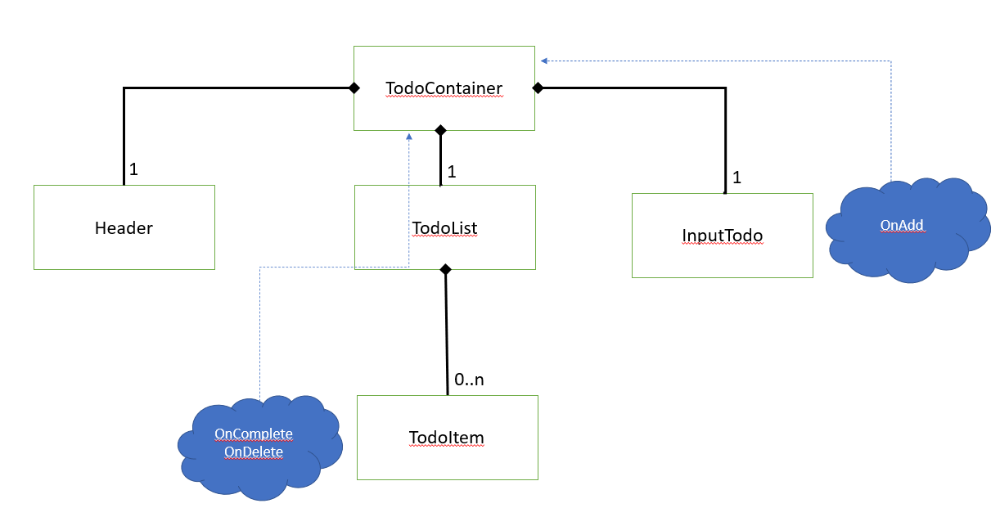

# React ToDo App
> A simple ToDo App written using React Components  
Build using the React tutorial for beginners by Ibas Majid, available [Here](https://ibaslogic.com/react-tutorial-for-beginners/) 

## Built With

- HTML
- CSS
- Javascript
- React Library

## Live Demo
[Live demo](https://vicperalta.github.io/math-magicians/)

## Sample demo

# App structure

The App, at this stage, contains five components:   
- *TodoContainer*. It is a class-based component that is responsible for holding the **state** of the application and contains the Header, InputTodo and the TodoList components. As it is the owner of the **state**, it is responsible for sending this information to the TodoList Component. It is also responsible of receiving the updated information from the InputTodo (to add a new todo), from the TodoList (to update the completed status or deleting a todo) and update the state.   
- *InputTodo*. A class-based component responsible for receiving the input from the user and notifying its parent about this information.   
- *Header*. A functional component that contains the App's title.   
- *TodoList*. A class-based component that hold the list of todos. It up-lift the events  coming from the todos to its parent Component.   
- *TodoItem*. A class-based component responsible for showing the todo and responding to the user interaction.

# Get a copy  

To get a local copy follow these simple example steps.  

1.- Open the terminal window and clone the repository using this command:  
`git clone git@github.com:VicPeralta/react-todo-app.git` 

2.- Change the directory to the math-magicians directory  
`cd react-todo-app`  
3.- Install the project's dependencies by running this command:   
`npm install`  
4.- Generate the dist folder using this command:  
`npm run build`  
5.- Run this command to see the page `npm start`  
6.- To see the code open the project in the code editor of your preference.  

## Author  
👤 **Ibas Majid**  
- Twitter: [@ibaslogic](https://twitter.com/ibaslogic)
## Developer 
👤 **Victor Peralta**
- GitHub: [@VicPeralta](https://github.com/VicPeralta)
- Twitter: [@VicPeralta](https://twitter.com/VicPeralta)
- Linkedin: [@VicPeralta](https://www.linkedin.com/in/victor-peralta-gomez-648072107/)

## 🤝 Contributing

Contributions, issues, and feature requests are welcome!

Feel free to check the [issues page](https://github.com/VicPeralta/react-todo-app/issues).

## Show your support

Give a ⭐️ if you like this project!

## Acknowledgments

- A special thank for @fernandorpm for this amazing [README template](https://github.com/microverseinc/readme-template)

## 📝 License

This project is [MIT](./LICENSE.md) licensed.

